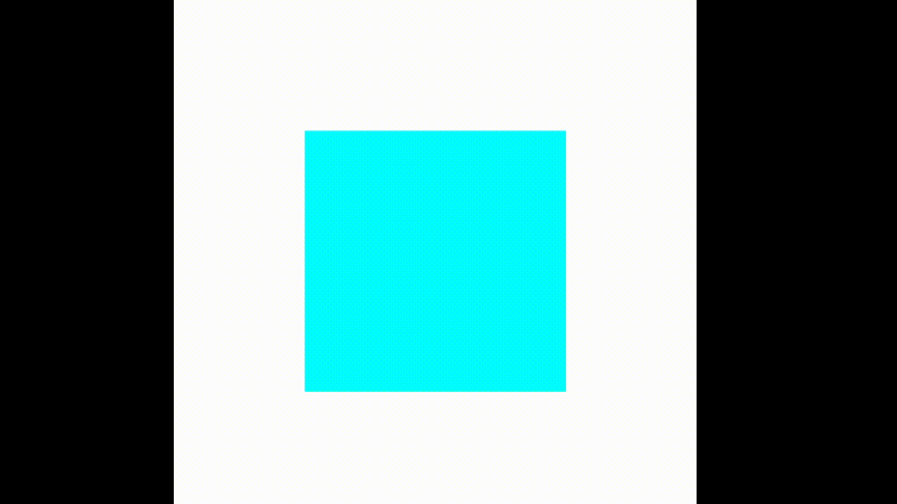

# Desafio M2

## Resumo da Atividade

O objetivo desta tarefa é implementar um visualizador 3D interativo de cubos, utilizando modelagem poligonal com malhas triangulares. O programa permite criar múltiplos cubos na cena, cada face com uma cor diferente, e controlar a rotação, translação e escala dos cubos via teclado. 

## Como Executar

1. **Pré-requisitos:**  
   - Tenha o [GLFW](https://www.glfw.org/) e o [GLAD](https://glad.dav1d.de/) configurados no seu ambiente.

2. **Compilação e Execução:**  
   No terminal, dentro da pasta do projeto, execute:
   ```
   cd build
   cmake --build .
   ```
   Após a compilação, execute o programa com:
   ```
   ./Cubo.exe
   ```
   Uma janela será aberta mostrando a cena 3D com cubos coloridos.

## Controles do Teclado

- **W / S**: Move o cubo selecionado para frente / trás (eixo Z)
- **A / D**: Move o cubo selecionado para esquerda / direita (eixo X)
- **I / J**: Move o cubo selecionado para cima / baixo (eixo Y)
- **[ / ]**: Diminui / aumenta a escala do cubo selecionado
- **X / Y / Z**: Rotaciona o cubo selecionado nos respectivos eixos
- **N**: Adiciona um novo cubo na cena, em posição aleatória (sem sobreposição)

## Resultado

Veja abaixo um exemplo do funcionamento:



---