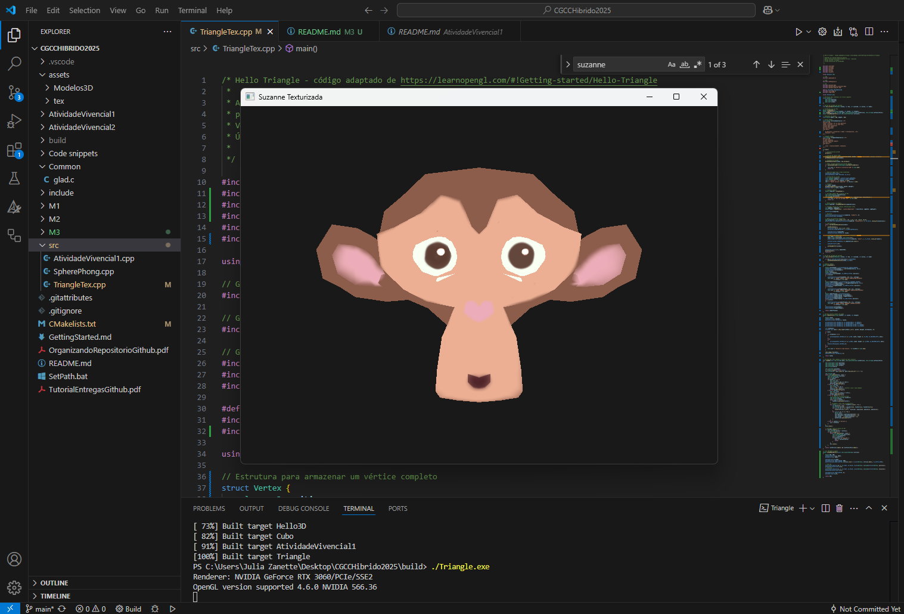

# Desafio M3

## Resumo da Atividade

O objetivo desta tarefa é implementar a leitura das coordenadas de texturas presentes no arquivo .OBJ, armazenando-as como atributo dos vértices e as informações sobre a textura contidas no arquivo .MTL (no momento, apenas o nome da textura a ser carregada). Foi seguido o material de apoio para implementar o arquivo Suzanne.obj com textura.

## Como Executar

1. **Pré-requisitos:**  
   - Tenha o [GLFW](https://www.glfw.org/) e o [GLAD](https://glad.dav1d.de/) configurados no seu ambiente.
   - Certifique-se de que os arquivos OBJ estejam na pasta `assets/Modelos3D/`.

2. **Compilação e Execução:**  
   No terminal, dentro da pasta do projeto, execute:
   ```
   cd build
   cmake --build .
   ```
   Após a compilação, execute o programa com:
   ```
   ./TriangleTex.exe
   ```
   Uma janela será aberta mostrando o modelo 3D.

## Resultado

Veja abaixo um exemplo do funcionamento da aplicação:



---
